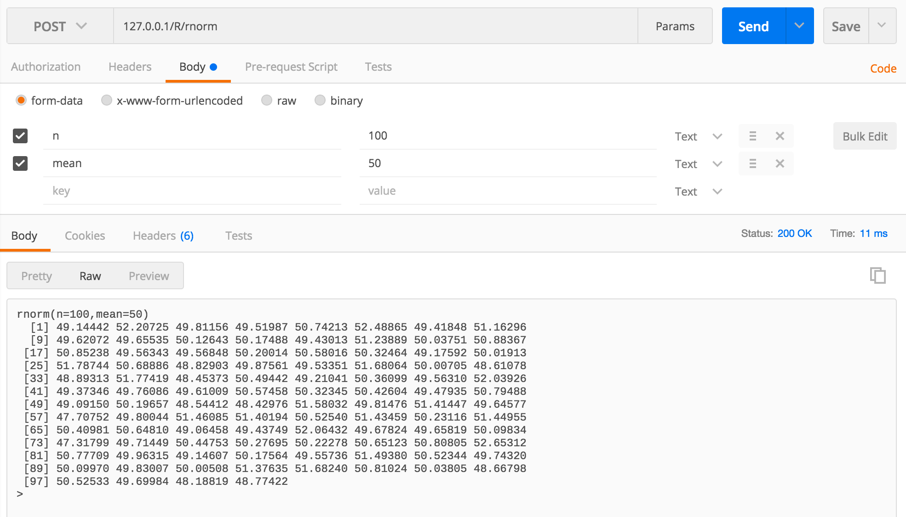

# RExpress

## Synopsis

RExpress is a *convenient*, *minimalist* and **fast** R wrapper written in node.js, on top of Express, allowing you to build a simple **HTTP API** over your R application.

To improve reactivity and replicability, RExpress is :

- stateless
- asynchronous
- made of a *pool of active R interpreters* (to avoid interpreter/libraries/data loading on each call)


## Code Example

```bash
# SERVER

# -- assuming R is installed
#    and your custom preload scripts are in /R folder

# start RExpress with default values (port #8080 and workers adapted to CPU)
npm start 	

# ... or with custom parameters

# TCP port
export PORT=4242	

# number of R threads to spawn
export NB_WORKERS=12
npm run start -- -p ${PORT} -w ${NB_WORKERS}

# CLIENT

# -- simple example with defaults values
# Call 'rnorm' function

curl -X POST -H "Content-Type: multipart/form-data " -F "n=100" "http://127.0.0.1:8080/R/rnorm"
> rnorm(n=100)
  [1] -1.13337176  0.31246821 -0.39101329 -0.01291213  0.60583716 -1.48063901
  [7]  0.10490980  1.19898789 -0.25830043 -0.26697524  1.38543256 -0.17299025
 [13]  0.77248097 -0.33143515  0.41032049 -0.24587841 -1.02653343 -0.75107243
 [19] -0.07954671  1.28059466  0.83287093 -0.64712467 -1.21699503  0.15702796
 [25]  1.32503344  0.67840176  0.60403186 -1.25660497 -0.15345367  0.97180750
 [31] -1.69962851  0.26594453  1.42088951  0.09635141 -0.61657457 -0.02480093
 [37]  0.64905455 -0.36009099  1.41108138  0.06796008 -0.61910010  1.11657908
 [43] -0.29160212  0.18191012  0.37878983 -0.21894661 -0.67244804 -1.05237921
 [49]  0.44339915  1.54763578  0.04350011 -0.41891076 -0.57928097  0.23328533
 [55] -1.45372599 -0.04630906  0.29571492 -0.32829771 -0.72622337  1.88726544
 [61]  0.09194559  2.87112797  0.03627627  1.13675949  0.93419112 -1.26427847
 [67] -1.52818406 -1.41240843 -0.70933359 -1.49698981 -0.29330895 -1.95261436
 [73]  0.60888877 -0.18957092  0.20261414 -1.20588920  0.40633645 -1.19483119
 [79]  1.35996127 -1.57953105 -2.30804630  1.53818668 -0.05184402  1.10724570
 [85] -0.99948157  0.97043861  0.53354444 -2.01127314 -1.54308952 -0.53364871
 [91] -1.40142968 -1.08684676  0.30534441  0.78448051 -0.66503028 -0.04124425
 [97]  1.05464664 -0.51600263  0.27437444 -1.23600668

```

Below an example in Postman, for a function returning several values.




```bash
# -- advanced examples
# Authorized internal routes and scripts

//api.js
exports.allow_free_routes = true
exports.allow_free_scripts = true

	-> internal route
curl -X POST -H "Content-Type: multipart/form-data " -F "n=100" "http://127.0.0.1:8080/R/rnorm"
> rnorm(n=100)
  [1] -1.13337176  0.31246821 -0.39101329 -0.01291213  0.60583716 -1.48063901
  [7]  0.10490980  1.19898789 -0.25830043 -0.26697524  1.38543256 -0.17299025
 [13]  0.77248097 -0.33143515  0.41032049 -0.24587841 -1.02653343 -0.75107243
 [19] -0.07954671  1.28059466  0.83287093 -0.64712467 -1.21699503  0.15702796
 [25]  1.32503344  0.67840176  0.60403186 -1.25660497 -0.15345367  0.97180750
 [31] -1.69962851  0.26594453  1.42088951  0.09635141 -0.61657457 -0.02480093
 [37]  0.64905455 -0.36009099  1.41108138  0.06796008 -0.61910010  1.11657908
 [43] -0.29160212  0.18191012  0.37878983 -0.21894661 -0.67244804 -1.05237921
 [49]  0.44339915  1.54763578  0.04350011 -0.41891076 -0.57928097  0.23328533
 [55] -1.45372599 -0.04630906  0.29571492 -0.32829771 -0.72622337  1.88726544
 [61]  0.09194559  2.87112797  0.03627627  1.13675949  0.93419112 -1.26427847
 [67] -1.52818406 -1.41240843 -0.70933359 -1.49698981 -0.29330895 -1.95261436
 [73]  0.60888877 -0.18957092  0.20261414 -1.20588920  0.40633645 -1.19483119
 [79]  1.35996127 -1.57953105 -2.30804630  1.53818668 -0.05184402  1.10724570
 [85] -0.99948157  0.97043861  0.53354444 -2.01127314 -1.54308952 -0.53364871
 [91] -1.40142968 -1.08684676  0.30534441  0.78448051 -0.66503028 -0.04124425
 [97]  1.05464664 -0.51600263  0.27437444 -1.23600668

	(-> script
curl -X POST -d 'a <- "Hello World"\n a \n' "http://127.0.0.1/R/"
> [1] "Hello World") à revoir

	-> custom route
curl -X POST -H "Content-Type: multipart/form-data " -F "text=texte" "http://127.0.0.1:8080/R/russia"
> cyrillize(text="texte")
[1] "тексте"

curl -X POST -H "Content-Type: multipart/form-data " -F "text=t" "http://127.0.0.1:8080/R/russia"
> Text length too short


# Unauthorized internal routes and scripts

//api.js
exports.allow_free_routes = false
exports.allow_free_scripts = false

	-> internal route
curl -X POST -H "Content-Type: multipart/form-data " -F "n=100" "http://127.0.0.1:8080/R/rnorm"
> Unkown Rfunction and not allowed to use internal call

	(-> script) à revoir
	
	-> custom route
curl -X POST -H "Content-Type: multipart/form-data " -F "text=texte" "http://127.0.0.1:8080/R/russia"
> cyrillize(text="texte")
[1] "тексте"

curl -X POST -H "Content-Type: multipart/form-data " -F "text=t" "http://127.0.0.1:8080/R/russia"
> Text length too short

```


## Installation

```bash
# clone repo
git clone theplatypus/RExpress
cd RExpress

npm install

# start RExpress with default values (port #8080 and workers adapted to CPU)
npm start 	

# ... or with custom parameters

# TCP port
export PORT=4242	

# number of R threads to spawn
export NB_WORKERS=12
npm run start -- -p ${PORT} -w ${NB_WORKERS}

```

## API Reference

The default API exposes two main endpoints :

### Internal call

*POST http://ip:port/R/%function%*

Read the form-data arguments given to call the function (replace this parameter with the actual function name).
Users actions are therefore restricted to this particular function scope.

```javascript
// api.js
// call a function w/ form-data (safe)
app.post('/R/:function', function (request, response) {
	// ...
})
```
### Script execute

*POST http://ip:port/R*

Interpret the whole POST body as a R program to execute.
As you imagine, it is very unsafe to do that, especially if your program have access to some data.
Testing purposes only, do not use in production.

```javascript

// execute the R program given in body
// -- very unsafe but useful in testing purposes
app.post('/R', text_parser, function (request, response) {
	// ...
})
```
### Custom routes

*POST http://ip:port/R/%fonction%


```javascript
rexpress.router.post('/R/route_name', function (request, response, next) {
	// ...testing the parameters
	
	request.Rfunction = "function_name"
		next()
	// ...
})
```
## Tweaking

There are two main ways to adapt this package towards your needs.

### Pool size

To avoid interpreter/libraries/data loading on each call, several interpreters are maintained in an active state in a pool.
Each call results in a pipe with one of those interpreters.
As R is single-threaded by default, you could choose to create as many worker as your CPU exposes threads.

To tweak this parameter, change the *nb parameter* at the pool creation in api.js

### Custom Scripts

If the workers should have data or libraries preloaded, you can store them in .R files and save them in the /R folder.

## Docker

You can use the Dockerfile to build a container with necessaries dependencies.

```bash
# clone repo
git clone theplatypus/RExpress
cd RExpress

# build image
docker build -t seed/RExpress .

# run image in a container
docker run \
	-p 8080:80 \
	--env NB_WORKERS="4" \
	seed/RExpress

# access RExpress at 192.168.99.100:8080 (your docker bridge0 addr)

```
## Issues and roadmap

- deal with long scripts (automatic cut in several jobs)

## Contributors

theplatypus

## License

MIT
